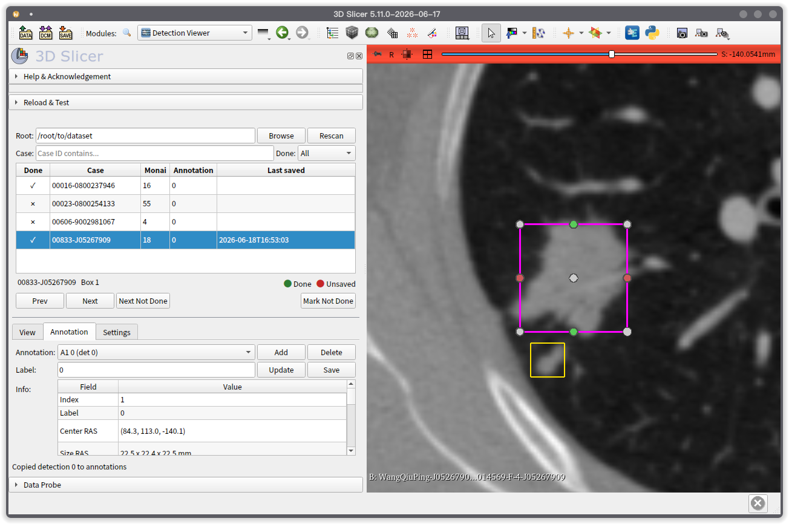
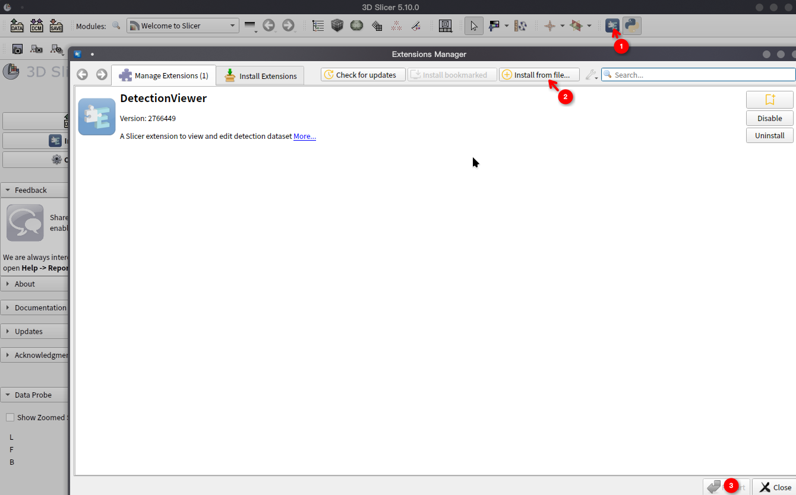
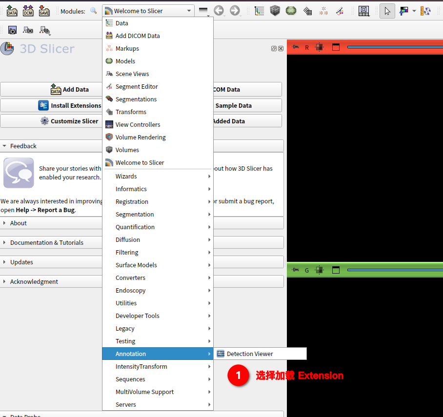
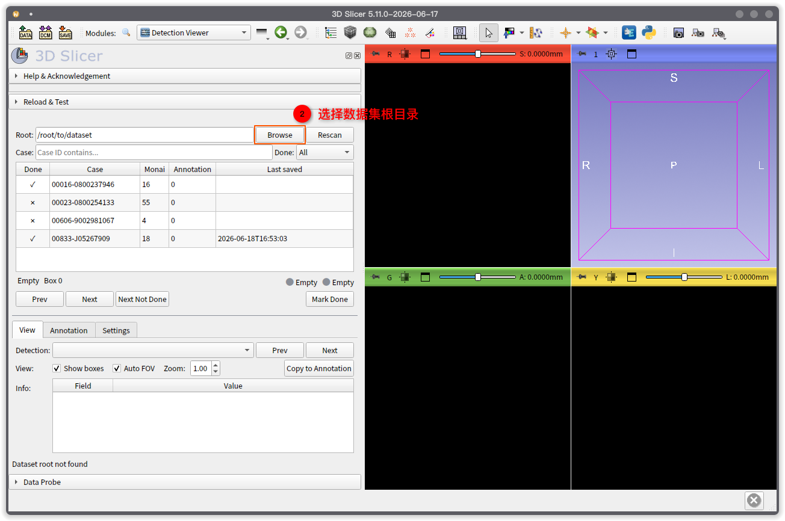
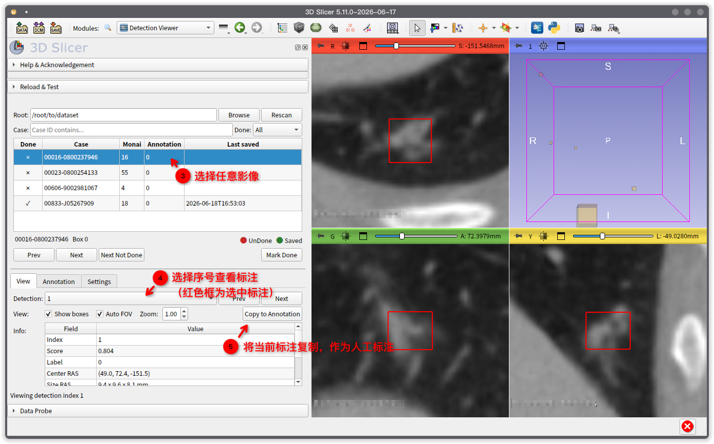
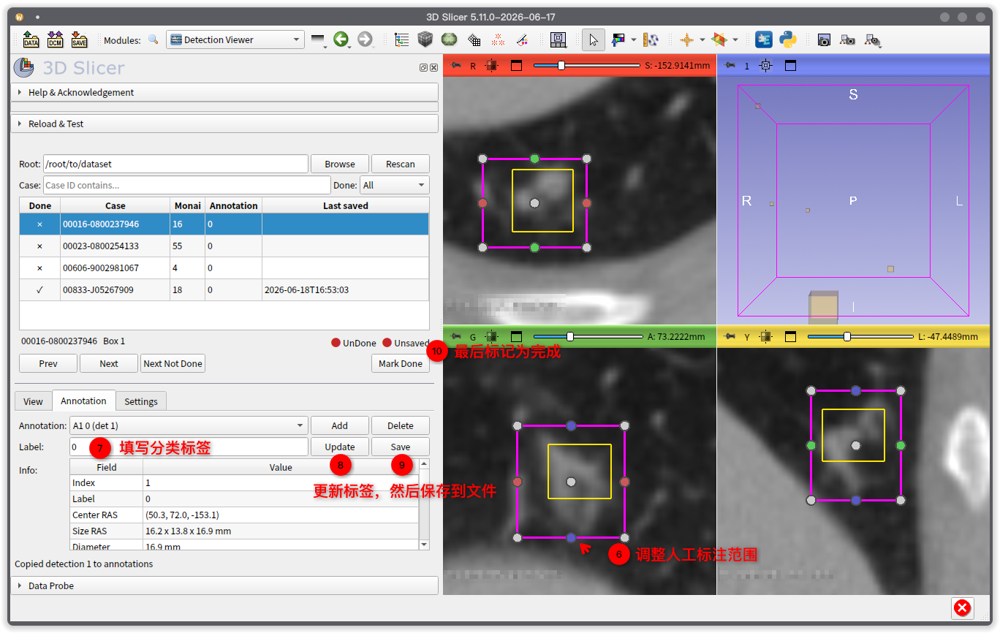

# DetectionViewer
 > 3D Slicer 版本：5.10.0 
 > 34045-linux-amd64-DetectionViewer-git2766449-2026-06-22.tar.gz

DetectionViewer 是一个 3D Slicer 扩展，用于查看 MONAI 等检测模型输出的 detection box，并在此基础上进行人工修正标注。典型流程是：加载数据集，逐例次查看预检测框，将可用 detection 复制为 annotation，调整 annotation 的位置、大小和 label，最后保存回当前例次的 `detection.json`。

<div align="center">
  
</div>

## 数据目录结构

我们给到的数据会按如下结构组织：

```text
dataset-root/
  any-group/
    case001/
      image.nii.gz
      detection.json
    case002/
      image.nii.gz
      detection.json
```

数据集浏览状态保存在 `.detection_viewer_index.json` 中。该文件会放在例次目录的父目录，例如：

```text
dataset-root/any-group/.detection_viewer_index.json
```

## 0.安装拓展

<div align="center">
  
</div>

1. 点击`install from file`
2. 选择文件`34045-linux-amd64-DetectionViewer-git2766449-2026-06-22.tar.gz`

## 1.打开模块

1. 启动 3D Slicer。
2. 打开模块列表。
3. 在 `Annotation` 中选择 `DetectionViewer`。

<div align="center">
  
</div>

## 加载数据集

1. 在 `Root` 中填写数据集根目录。
2. 点击 `Browse`，或直接粘贴路径后离开输入框。

<div align="center">
  
</div>

  >当磁盘上的数据发生变化时，点击 `Rescan` 重新扫描。

字段说明：

- `Done`：该例次是否已完成。
- `Case`：例次编号。
- `Monai`：AI detection 数量。
- `Annotation`：当前人工标注数量。
- `Last saved`：最近一次保存 annotation 的时间。

## 查看 Detection

进入 `View` 页签。


<div align="center">
  
</div>

`Detection` 下拉框列出当前显示的 detection 编号。选择某个编号后，模块会高亮该 detection box，并在三个平面视图和 3D 视图中显示。

颜色含义：

- 黄色：普通参考 detection box。
- 红色：当前选中的参考 detection box。

按钮功能：

- `Show boxes`：显示或隐藏参考 detection box，不影响 annotation box。
- `Auto FOV`：选择 detection 时是否自动调整切片视图范围。
- `Zoom`：自动 FOV 的放大倍率。

当某个 detection 可以作为人工标注的初始框时：

1. 在 `View` 页签的 `Detection` 下拉框中选中该 detection。
2. 点击右侧 `Copy to Annotation`。
3. 切换到 `Annotation` 页签继续编辑。

复制后会创建一个新的 annotation box。原始 detection box 不会被修改。

## 编辑 Annotation

进入 `Annotation` 页签。

<div align="center">
  
</div>

1. 在 `Annotation` 下拉框中选择要编辑的 annotation。
2. 只有当前选中的 annotation 会显示编辑句柄。
3. 在平面视图或 3D 视图中拖动句柄，调整 box 的位置和大小。
4. 在 `Label` 中填写分类标签，默认值为 `0`。
5. 点击 `Update` 将当前 label 写入选中的 annotation。

颜色含义：

- 绿色：普通 annotation。
- 紫色：当前选中的、处于编辑状态的 annotation。

## 新增或删除 Annotation

新增空 annotation：

1. 将切片视图移动到目标区域附近。
2. 设置 `Label`。
3. 点击 `Add`。
4. 在 `Annotation` 下拉框中选中新建的 annotation。
5. 使用编辑句柄调整位置和大小。

删除 annotation：

1. 在 `Annotation` 下拉框中选择目标 annotation。
2. 点击 `Delete`。

## 保存标注结果

在 `Annotation` 页签点击 `Save`。

模块会将当前例次的所有 annotation 写入当前 `detection.json` 的顶层 `annotation` 字段：

```json
{
  "raw_detections": [],
  "annotation": [
    {
      "index": 1,
      "label": "0",
      "box_mode": "xyzxyz",
      "box_xyzxyz_ras": [0, 0, 0, 10, 10, 10],
      "box_cccwhd_ras": [5, 5, 5, 10, 10, 10],
      "size_mm": [10, 10, 10]
    }
  ]
}
```

## 标记例次完成

完成当前例次审核后：

1. 确认 annotation 已保存。
2. 点击 `Mark Done`。
3. 点击 `Next Not Done` 跳转到下一个未完成例次。

## 标注流程

1. 选择数据集 `Root`。
2. 使用 `Done` 筛选到 `Not Done`。
3. 加载一个例次。
4. 在 `View` 页签查看 detection box。
5. 将可用 detection 复制到 annotation。
6. 在 `Annotation` 页签调整 box 和 label。
7. 使用 `Add` 补充漏检目标。
8. 使用 `Delete` 删除不需要的 annotation。
9. 点击 `Save` 保存到 `detection.json`。
10. 点击 `Mark Done` 标记完成。
11. 点击 `Next Not Done` 继续下一个例次。
